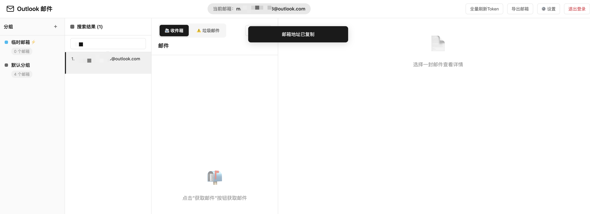
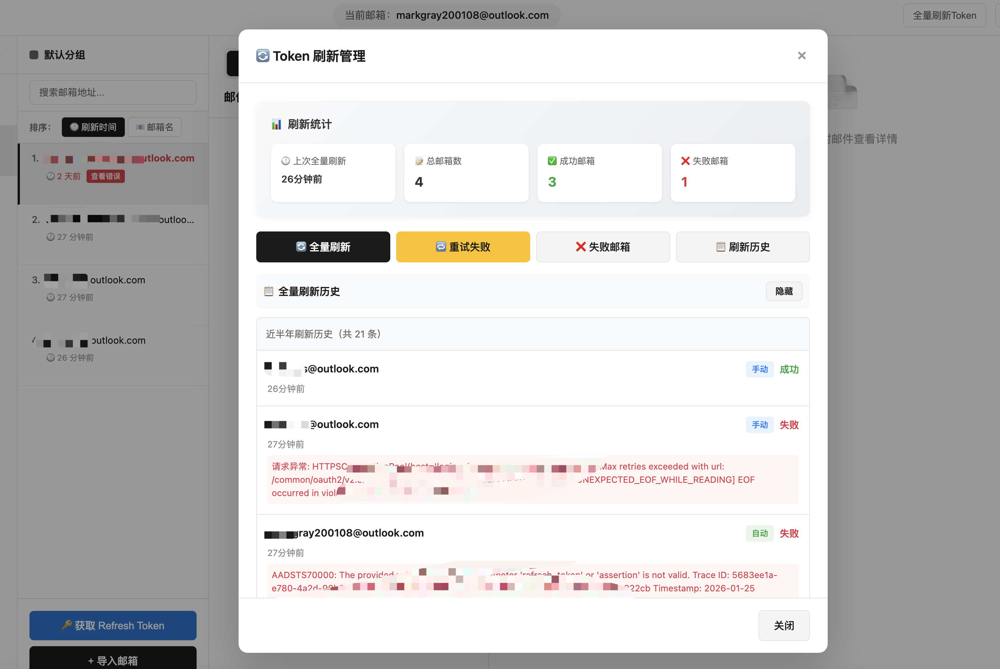
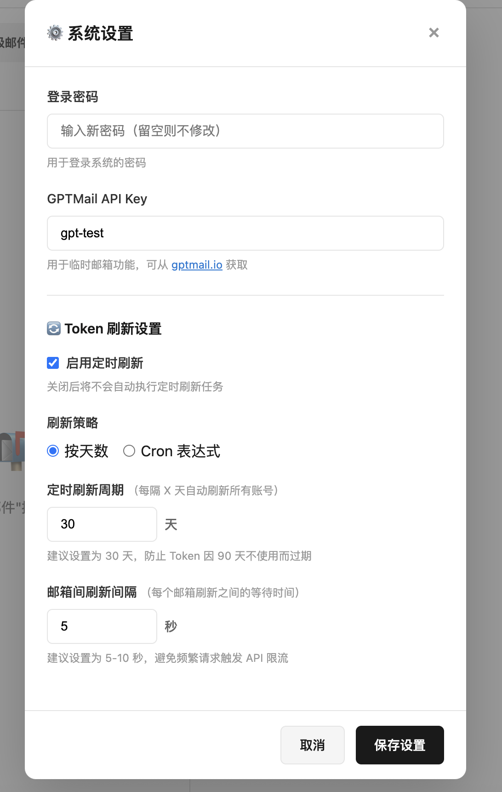
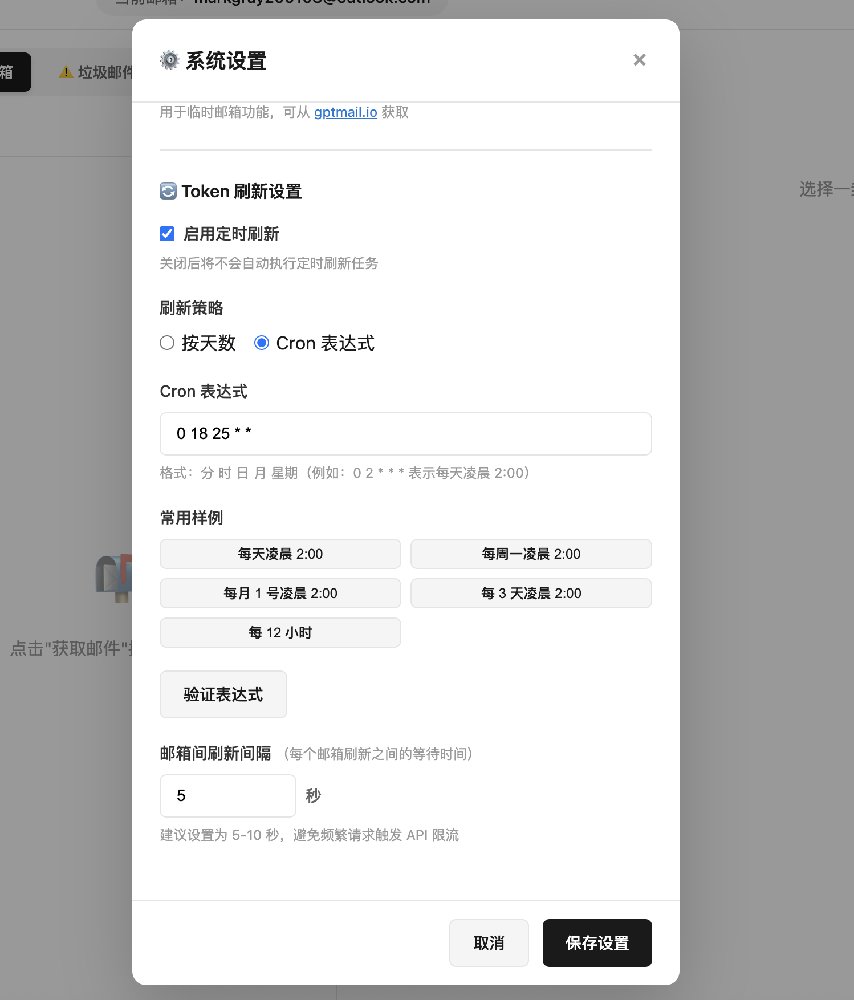

# Outlook 邮件管理工具

一个功能完整的 Outlook 邮件管理解决方案，支持多种方式读取 Outlook 邮箱邮件，并提供 Web 界面进行邮箱账号管理和邮件查看。

## ✨ 功能特性

### 邮件读取方式
本工具支持三种方式读取 Outlook 邮箱邮件：

1. **旧版 IMAP 方式** - 使用 `outlook.office365.com` 服务器
2. **新版 IMAP 方式** - 使用 `outlook.live.com` 服务器
3. **Graph API 方式** - 使用 Microsoft Graph API（推荐）

### Web 应用功能

#### 核心功能
- 🔐 **登录验证** - 密码保护的 Web 界面，支持在线修改密码
- 📁 **分组管理** - 支持创建、编辑、删除邮箱分组，自定义分组颜色
- 📧 **多邮箱管理** - 批量导入和管理多个 Outlook 邮箱账号
- 📬 **邮件查看** - 查看收件箱、垃圾邮件和已删除邮件
- 🔍 **全屏查看** - 支持全屏模式查看邮件，完整展示长邮件内容（⭐ 2026-01-23 新增）
- 📤 **导出功能** - 支持按分组或全部导出邮箱账号信息，二次验证保护（⭐ 2026-01-26 增强）
- 🎨 **现代化 UI** - 简洁美观的四栏式界面布局
- ⚡ **性能优化** - 智能缓存机制，快速切换分组和邮箱
- 📄 **分页加载** - 邮件列表支持滚动到底部自动加载下一页（每页20封）
- 🗑️ **多文件夹支持** - 支持查看收件箱、垃圾邮件、已删除邮件
- 🔥 **临时邮箱** - 集成 GPTMail API，一键生成临时邮箱
- ⚙️ **系统设置** - 支持在线修改登录密码和 GPTMail API Key
- 🔄 **OAuth2 助手** - 内置 OAuth2 授权流程，快速获取 Refresh Token
- 💾 **邮件缓存** - 智能缓存邮件列表，切换邮箱/文件夹即时展示，刷新页面清空缓存（⭐ 2026-01-29 新增）
- 🔓 **信任邮件模式** - 支持查看原始邮件内容，可选择绕过安全过滤（⭐ 2026-01-29 新增）
- 🏷️ **标签管理** - 支持给邮箱账号打标签，支持批量打标签/去标签，支持按标签筛选（⭐ 2026-01-31 新增）
- 📦 **批量移动分组** - 支持批量选择复个邮箱账号并移动到指定分组（⭐ 2026-02-08 新增）
- 🗑️ **邮件删除** - 支持单封/批量永久删除邮件，二次确认防误删（⭐ 2026-01-31 新增），注意：买的号大概率是没有开删除的api权限的 所以删除大概率会失败，自己授权的删除应该无问题

#### Token 刷新管理
- 🔁 **全量刷新** - 一键刷新所有账号 Token，实时进度展示，防止 90 天过期（⭐ 2026-01-23 新增）
- ⏰ **定时刷新配置** - 支持按天数或 Cron 表达式配置自动刷新，提供常用样例（⭐ 2026-01-25 新增）
- 🔔 **定时刷新开关** - 可随时启用或禁用定时刷新任务（⭐ 2026-01-25 新增）
- 📊 **刷新统计优化** - 实时显示当前失败状态的邮箱数量，准确反映账号健康状态（⭐ 2026-01-25 新增）
- 📜 **刷新历史管理** - 展示近半年完整刷新历史，自动清理过期记录（⭐ 2026-01-25 新增）
- ❌ **失败邮箱标识** - 刷新失败的邮箱加粗标红显示，一目了然（⭐ 2026-01-25 新增）
- 📝 **备注展示** - 邮箱列表中显示账号备注信息，便于识别和管理（⭐ 2026-01-25 新增）

#### 安全特性（⭐ 2026-01-26 新增）
- 🛡️ **XSS 防护** - 多层防护机制，防止跨站脚本攻击
  - 邮件内容使用 DOMPurify 净化，移除恶意脚本
  - iframe 沙箱隔离，禁止脚本执行
  - 用户输入自动转义，防止存储型 XSS
- 🔒 **CSRF 防护** - 使用 Flask-WTF 实现 CSRF Token 验证
  - 所有状态变更操作需要 CSRF Token
  - 自动化 Token 管理，对用户透明
  - 优雅降级，未安装时仍可正常使用
- 🔐 **敏感数据加密** - 使用 Fernet 对称加密保护敏感信息
  - Refresh Token 加密存储
  - 密码哈希存储（bcrypt）
  - 基于 SECRET_KEY 的加密密钥派生
- 🚦 **登录速率限制** - 防止暴力破解攻击
  - 5 次失败后锁定 15 分钟
  - 基于 IP 地址的速率限制
  - 自动解锁机制
- 📋 **审计日志** - 记录所有敏感操作
  - 导出操作审计
  - 记录操作时间、IP 地址和详细信息
  - 便于安全追溯和合规审计
- 🔑 **二次验证** - 导出功能需要密码确认
  - 一次性验证 Token
  - 防止未授权导出
  - 保护敏感凭据安全

### 界面布局
Web 应用采用四栏式布局设计：
1. **分组面板** - 显示所有邮箱分组，点击切换
2. **邮箱面板** - 显示当前分组下的邮箱账号列表
3. **邮件列表** - 显示选中邮箱的邮件，支持切换文件夹和滚动加载
4. **邮件详情** - 显示选中邮件的完整内容（支持 HTML 渲染）

## 📸 界面预览

### 邮箱列表界面


### 全局搜索功能


### 导入邮箱账号


### Token 刷新管理


### 定时刷新配置 - 按天数


### 定时刷新配置 - 按 Cron 表达式


### 登录速率限制保护


### 标签管理功能（⭐ 2026-01-31 新增）


### OAuth2 授权流程

#### 步骤 1：应用注册


#### 步骤 2：注册应用程序


#### 步骤 3：获取应用程序 ID


#### 步骤 4：换取 Token


## 📦 快速开始

### 方式一：使用 Docker（推荐）

直接使用 GitHub Actions 自动构建的镜像，无需本地构建：

```bash
# 拉取最新镜像
docker pull ghcr.io/assast/outlookemail:latest

# 运行容器
docker run -d \
  --name outlook-mail-reader \
  -p 5000:5000 \
  -v $(pwd)/data:/app/data \
  -e LOGIN_PASSWORD=admin123 \
  -e SECRET_KEY=your-secret-key-here \
  ghcr.io/assast/outlookemail:latest

# 查看日志
docker logs -f outlook-mail-reader

# 停止容器
docker stop outlook-mail-reader
docker rm outlook-mail-reader
```

**首次启动会自动：**
- 创建数据目录
- 初始化数据库
- 创建默认分组和临时邮箱分组
- 设置默认密码（admin123）

### 方式二：使用 Python 直接运行

```bash
# 克隆仓库
git clone https://github.com/assast/outlookEmail.git
cd outlookEmail

# 安装依赖
pip install -r requirements.txt

# 设置环境变量（可选）
export LOGIN_PASSWORD=admin123
export SECRET_KEY=your-secret-key-here
export PORT=5000

# 运行应用
python web_outlook_app.py
```

访问 `http://localhost:5000` 即可使用。

### 使用 Docker Compose

修改 `docker-compose.yml` 使用预构建镜像：

```yaml
version: '3.8'

services:
  outlook-mail-reader:
    image: ghcr.io/assast/outlookemail:latest
    container_name: outlook-mail-reader
    ports:
      - "5000:5000"
    volumes:
      - ./data:/app/data
    environment:
      - LOGIN_PASSWORD=admin123
      - FLASK_ENV=production
    restart: unless-stopped
```

然后启动服务：

```bash
# 启动服务
docker-compose up -d

# 查看日志
docker-compose logs -f

# 停止服务
docker-compose down
```

## 🔧 配置说明

### 环境变量

在 `docker-compose.yml` 中可以配置以下环境变量：

| 变量名 | 说明 | 默认值 |
|--------|------|--------|
| `SECRET_KEY` | Session 密钥（**必须设置**） | 无默认值，必须提供，请勿随意修改，数据库会基于这个加密，如果要改请先导出邮箱账号，改之后再重新导入账号 |
| `LOGIN_PASSWORD` | 登录密码 | `admin123` |
| `FLASK_ENV` | 运行环境 | `production` |
| `PORT` | 应用端口 | `5000` |
| `HOST` | 监听地址 | `0.0.0.0` |
| `DATABASE_PATH` | 数据库路径 | `data/outlook_accounts.db` |
| `GPTMAIL_BASE_URL` | GPTMail API 地址 | `https://mail.chatgpt.org.uk` |
| `GPTMAIL_API_KEY` | GPTMail API Key | `gpt-test` |
| `OAUTH_CLIENT_ID` | OAuth 客户端 ID | `建议使用自己的，如果实在搞不到不填的话会使用默认的` |
| `OAUTH_REDIRECT_URI` | OAuth 重定向 URI | `建议使用自己的，如果实在搞不到不填的话会使用默认的` |

**生成 SECRET_KEY：**
```bash
# 使用 Python 生成随机密钥
python -c 'import secrets; print(secrets.token_hex(32))'
```

### 数据持久化

数据库文件存储在 `./data` 目录中，通过 Docker Volume 挂载实现持久化。

数据库包含以下表：
- `settings` - 系统设置（登录密码、API Key 等）
- `groups` - 邮箱分组
- `accounts` - Outlook 邮箱账号
- `account_refresh_logs` - 账号刷新记录（⭐ 2026-01-23 新增）
- `temp_emails` - 临时邮箱
- `temp_email_messages` - 临时邮箱的邮件

### 端口映射

默认映射 5000 端口，可以在 `docker-compose.yml` 中修改：

```yaml
ports:
  - "8080:5000"  # 将容器的 5000 端口映射到主机的 8080 端口
```

## 🚀 Docker 部署

### 使用 Docker Compose（推荐）

修改 `docker-compose.yml` 使用预构建镜像：

```yaml
version: '3.8'

services:
  outlook-mail-reader:
    image: ghcr.io/assast/outlookemail:latest
    container_name: outlook-mail-reader
    ports:
      - "5000:5000"
    volumes:
      - ./data:/app/data
    environment:
      - LOGIN_PASSWORD=admin123
      - SECRET_KEY=your-secret-key-here
      - FLASK_ENV=production
      - GPTMAIL_API_KEY=your-api-key
    restart: unless-stopped
```

然后启动服务：

```bash
# 启动服务
docker-compose up -d

# 查看日志
docker-compose logs -f

# 停止服务
docker-compose down
```

### 镜像说明

项目使用 GitHub Actions 自动构建并推送 Docker 镜像到 `ghcr.io/assast/outlookemail:latest`。

#### 可用镜像标签

- `ghcr.io/assast/outlookemail:latest` - 最新的主分支构建（推荐）
- `ghcr.io/assast/outlookemail:main` - main 分支最新版本

#### 更新镜像

```bash
# 拉取最新镜像
docker pull ghcr.io/assast/outlookemail:latest

# 重启容器
docker-compose down
docker-compose up -d
```

#### 自己构建镜像（可选）

如果需要修改代码或自定义构建：

```bash
# 构建镜像
docker build -t outlook-mail-reader .

# 运行自己构建的镜像
docker run -d \
  --name outlook-mail-reader \
  -p 5000:5000 \
  -v $(pwd)/data:/app/data \
  -e LOGIN_PASSWORD=admin123 \
  outlook-mail-reader
```

## 📖 使用说明

### 1. 获取 OAuth2 凭证

要使用本工具，您需要获取以下 OAuth2 凭证：

1. **Client ID** - Microsoft Azure 应用注册的客户端 ID
2. **Refresh Token** - OAuth2 刷新令牌

#### 步骤 1：注册 Azure 应用

访问 [Azure Portal](https://portal.azure.com/)，进入「应用注册」：


#### 步骤 2：创建新应用

点击「新注册」，填写应用信息：


- **名称**：自定义应用名称
- **支持的账户类型**：选择「任何组织目录中的账户和个人 Microsoft 账户」
- **重定向 URI**：选择「公共客户端/本机」，填写 `http://localhost:8080`

#### 步骤 3：获取应用程序 ID

创建完成后，复制「应用程序(客户端) ID」：


#### 步骤 4：配置 API 权限  这一步应该可以省略，目前内置的客户端id就没有设置这一步也能正常使用

在「API 权限」中添加以下权限：
- `offline_access` - 获取刷新令牌
- `Mail.Read` - 读取邮件
- `Mail.ReadWrite` - 读写邮件
- `User.Read` - 读取用户信息
- `IMAP.AccessAsUser.All` - IMAP 访问

#### 步骤 5：获取 Refresh Token

使用本工具内置的 OAuth2 助手获取 Refresh Token：


1. 在 Web 界面点击「获取 Token」按钮
2. 点击「生成授权链接」
3. 复制链接到浏览器打开，完成授权
4. 复制授权后的完整 URL（处于安全考虑，我没有统一建设授权回调服务，所有授权都在自己部署的服务内完成，不会外泄，所以重定向URI为http://localhost:8080，这个链接肯定是打不开的，所以要复制过来在部署的服务走后半段的换取Refresh Token）
5. 粘贴到「授权后的 URL」输入框
6. 点击「换取 Token」按钮
7. 复制获得的 Refresh Token

### 2. 导入邮箱账号

在 Web 界面中，点击「导入邮箱」按钮，按以下格式输入账号信息：

```
邮箱----密码----client_id----refresh_token
```

示例：
```
user@outlook.com----password123----24d9a0ed-8787-4584-883c-2fd79308940a----0.AXEA...
```

支持批量导入，每行一个账号。**注意：导入邮箱时不能选择临时邮箱分组。**

### 3. 查看邮件

1. 从左侧选择分组
2. 选择邮箱账号
3. 点击「获取邮件」按钮
4. 切换「收件箱」、「垃圾邮件」或「已删除」标签查看不同文件夹的邮件
5. 滚动到邮件列表底部自动加载下一页（每页20封）
6. 点击邮件查看详情（支持 HTML 渲染）
7. 点击「🔍 全屏查看」按钮，在全屏模式下查看完整邮件内容

**全屏查看功能：**
- 支持滚动查看长邮件的完整内容
- 按 ESC 键或点击背景区域关闭全屏模式
- 自动调整内容高度，确保邮件完整显示
- 支持 HTML 邮件和纯文本邮件

**邮件缓存功能（⭐ 2026-01-29 新增）：**
- 切换邮箱或文件夹时，如果已有缓存数据则立即展示，无需等待加载
- 点击「获取邮件」按钮会清空当前邮件列表缓存并获取最新数据
- 下拉加载更多邮件时，新数据会追加到现有缓存中
- 刷新浏览器页面会清空所有缓存

**信任邮件模式（⭐ 2026-01-29 新增）：**
- 在邮件详情工具栏中，「🔍 全屏查看」按钮旁边有「信任此邮件」复选框
- 勾选后会弹出安全警告，确认后将显示邮件的原始内容（绕过 HTML 安全过滤）
- 适用于查看被过滤掉样式或脚本的复杂邮件
- ⚠️ **安全警告**：信任模式会显示未经过滤的原始内容，可能包含恶意脚本，请仅对可信邮件使用
- 切换到其他邮件时，信任模式会自动关闭

**注意：** 切换文件夹标签后，如果有缓存会直接显示，否则需要点击「获取邮件」按钮加载。

### 4. 临时邮箱功能

系统集成了 GPTMail API 提供临时邮箱服务：

1. **生成临时邮箱** - 点击「临时邮箱」分组，然后点击「生成临时邮箱」按钮
2. **查看邮件** - 选择临时邮箱后点击「获取邮件」按钮
3. **刷新邮件** - 点击「刷新」按钮获取最新邮件
4. **清空邮件** - 点击「清空」按钮，清空该邮箱的所有邮件
5. **删除邮箱** - 点击「删除」按钮，删除邮箱及其所有邮件

临时邮箱数据会存储在本地数据库中，方便后续查看。

### 5. 分组管理

- **创建分组** - 点击分组面板的「+」按钮
- **编辑分组** - 点击分组旁的「编辑」按钮，可修改名称、描述和颜色
- **删除分组** - 点击分组旁的「删除」按钮（默认分组不可删除）
- **导出分组** - 点击分组旁的「导出」按钮，导出该分组下的所有邮箱账号

### 6. 标签管理（⭐ 2026-01-31 新增）

标签功能允许您为邮箱账号添加自定义标签，方便分类和筛选。

#### 创建和管理标签
1. 点击邮箱面板标题栏的「🏷️」按钮，打开标签管理弹窗
2. 输入标签名称，选择标签颜色，点击「创建」
3. 已有标签会显示在列表中，可点击右侧的「删除」按钮移除

#### 给邮箱打标签
1. 在邮箱列表中，勾选一个或多个邮箱账号（每个邮箱左侧有复选框）
2. 底部会出现批量操作栏，显示「已选 N 项」
3. 点击「打标签」按钮，选择要添加的标签，确认即可
4. 标签会以彩色徽章形式显示在邮箱备注下方

#### 去除邮箱标签
1. 勾选已打标签的邮箱账号
2. 点击底部操作栏的「去标签」按钮
3. 选择要移除的标签，确认即可

#### 按标签筛选邮箱
1. 在排序按钮下方，有一行标签筛选区（仅在有标签时显示）
2. 勾选一个或多个标签复选框
3. 邮箱列表会自动过滤，只显示包含所选标签的账号
4. 取消所有勾选可恢复显示全部账号

#### 搜索标签
- 在全局搜索框中输入标签名称，可搜索到带有该标签的邮箱账号


### 7. 批量移动分组（⭐ 2026-02-08 新增）

支持批量选择多个邮箱账号，一次性移动到指定分组。

#### 使用步骤
1. 在邮箱列表中，勾选需要移动的邮箱账号（每个邮箱左侧有复选框）
2. 底部会出现批量操作栏，显示「已选 N 项」
3. 点击「移动分组」按钮
4. 在弹出的对话框中选择目标分组
5. 点击「确认移动」，账号将被移动到目标分组

> [!NOTE]
> **系统分组限制**：不能将邮箱移动到「临时邮箱」等系统分组。

### 8. 邮件删除（⭐ 2026-01-31 新增）

支持单封或批量永久删除邮件。

> [!WARNING]
> **关于删除权限**：如果邮箱账号是从第三方购买的，大概率没有开启 `Mail.ReadWrite` 删除 API 权限，删除操作会失败。只有使用自己注册的 Azure 应用授权的账号，删除功能才能正常使用。

#### 单封删除
1. 在邮件列表中点击打开一封邮件
2. 在邮件详情工具栏右侧点击「🗑️ 删除」按钮
3. 确认删除提示，邮件将被永久删除

#### 批量删除
1. 在邮件列表中，勾选需要删除的邮件（每封邮件左侧有复选框）
2. 底部会出现批量操作栏，显示「已选 N 项」
3. 点击「🗑️ 删除」按钮
4. 确认删除提示，选中的邮件将被永久删除

> [!CAUTION]
> **永久删除**：删除操作不可恢复！邮件将被直接永久删除，不会移动到"已删除"文件夹。

### 9. 系统设置

点击导航栏的「⚙️ 设置」按钮，可以修改以下配置：

1. **登录密码** - 修改 Web 界面的登录密码（至少4位）
2. **GPTMail API Key** - 设置临时邮箱功能所需的 API Key
3. **定时刷新配置** - 配置 Token 自动刷新策略

#### 按天数定时刷新


#### 按 Cron 表达式定时刷新


设置会保存在数据库中，重启应用后仍然有效。

### 10. Token 刷新管理（⭐ 2026-01-23 新增，2026-01-25 增强）

为了防止 Refresh Token 因 90 天不使用而过期，系统提供了强大的 Token 刷新管理功能：

#### 功能特性
- **全量刷新** - 一键测试所有账号的 Token 有效性，支持强制刷新
- **实时进度** - 显示当前处理的账号、成功/失败数量
- **智能统计** - 显示总邮箱数、成功邮箱数、失败邮箱数
- **失败重试** - 支持单个或批量重试失败的账号
- **失败邮箱列表** - 查看当前失败状态的邮箱，显示错误原因和最后刷新时间
- **刷新历史** - 展示近半年完整刷新历史，支持查看所有全量刷新记录
- **定时刷新** - 支持按天数或 Cron 表达式配置自动刷新策略
- **刷新开关** - 可随时启用或禁用定时刷新任务
- **记录管理** - 自动清理超过半年的旧记录，保持数据库整洁

#### 使用方法
1. 点击顶部导航栏的「全量刷新Token」按钮
2. 确认刷新提示
3. 实时查看刷新进度和统计
4. 刷新完成后查看结果
5. 如有失败，可点击「❌ 失败邮箱」查看详情并重试
6. 点击「📋 刷新历史」查看近半年所有刷新记录

#### 定时刷新配置
1. 点击「⚙️ 设置」按钮
2. 在"Token 刷新设置"部分配置：
   - **启用定时刷新**：勾选或取消勾选开关
   - **刷新策略**：选择"按天数"或"Cron 表达式"
   - **按天数**：设置每隔 X 天自动刷新（1-90 天）
   - **Cron 表达式**：输入 Cron 表达式或点击常用样例
3. 点击"验证表达式"查看下次执行时间
4. 保存设置，重启应用后生效

#### 常用 Cron 样例
- 每天凌晨 2:00 - `0 2 * * *`
- 每周一凌晨 2:00 - `0 2 * * 1`
- 每月 1 号凌晨 2:00 - `0 2 1 * *`
- 每 3 天凌晨 2:00 - `0 2 */3 * *`
- 每 12 小时 - `0 */12 * * *`

#### 建议
- 建议启用定时刷新，设置为每 30 天自动刷新
- 及时处理失败的账号，重新获取 Token
- 定期查看刷新历史，了解账号健康状态
- 失败邮箱会在列表中加粗标红显示，便于识别


## 🌐 生产环境部署

### 使用 Nginx + HTTPS

**1. 安装 Nginx**
```bash
sudo apt install nginx certbot python3-certbot-nginx -y
```

**2. 配置 Nginx** `/etc/nginx/sites-available/outlook-mail-reader`
```nginx
server {
    listen 80;
    server_name your-domain.com;

    location / {
        proxy_pass http://localhost:5000;
        proxy_set_header Host $host;
        proxy_set_header X-Real-IP $remote_addr;
        proxy_set_header X-Forwarded-For $proxy_add_x_forwarded_for;
        proxy_set_header X-Forwarded-Proto $scheme;

        # WebSocket 支持（如果需要）
        proxy_http_version 1.1;
        proxy_set_header Upgrade $http_upgrade;
        proxy_set_header Connection "upgrade";
    }
}
```

**3. 启用配置**
```bash
sudo ln -s /etc/nginx/sites-available/outlook-mail-reader /etc/nginx/sites-enabled/
sudo nginx -t
sudo systemctl reload nginx
```

**4. 配置 HTTPS**
```bash
sudo certbot --nginx -d your-domain.com
```

### 使用 Caddy（更简单）

```bash
# 安装 Caddy
sudo apt install caddy -y

# 配置 /etc/caddy/Caddyfile
your-domain.com {
    reverse_proxy localhost:5000
}

# 重载（自动 HTTPS）
sudo systemctl reload caddy
```

## 🔐 安全配置

### 1. 修改默认密码

**方式一：通过环境变量**

在 `docker-compose.yml` 中：
```yaml
environment:
  - LOGIN_PASSWORD=your_secure_password_here
  - SECRET_KEY=your-random-secret-key-here
```

**方式二：通过 Web 界面**

登录后点击「⚙️ 设置」按钮，在线修改登录密码。

### 2. 启用 CSRF 防护（推荐）

CSRF 防护默认启用，如果未安装 flask-wtf，系统会优雅降级：

```bash
# 安装 CSRF 防护依赖
pip install flask-wtf>=1.2.0

# 或使用完整依赖安装
pip install -r requirements.txt
```

**CSRF 防护特性：**
- 自动为所有状态变更操作添加 CSRF Token
- 防止跨站请求伪造攻击
- 对用户完全透明，无需手动操作
- 未安装时自动降级，不影响功能使用

### 3. 登录速率限制

系统内置登录速率限制，防止暴力破解：

- **失败次数限制**：5 次失败后锁定
- **锁定时长**：15 分钟
- **基于 IP**：每个 IP 独立计数
- **自动解锁**：锁定时间到期后自动解锁


### 4. 敏感数据加密

所有敏感数据都经过加密存储：

**加密内容：**
- Refresh Token（Fernet 对称加密）
- 登录密码（bcrypt 哈希）
- 邮箱密码（Fernet 对称加密）

**加密密钥：**
- 基于 SECRET_KEY 派生加密密钥
- 使用 PBKDF2HMAC 密钥派生函数
- 100,000 次迭代，SHA256 算法

**重要提示：**
- SECRET_KEY 必须设置且保持不变
- 更改 SECRET_KEY 会导致无法解密已存储的数据
- 如需更改，请先导出账号，更改后重新导入

### 5. 导出功能二次验证

导出功能需要密码确认，防止未授权导出：

**保护机制：**
- 导出前需要输入登录密码
- 一次性验证 Token，使用后立即失效
- 所有导出操作记录审计日志
- 记录操作时间、IP 地址和导出详情

**审计日志：**
```sql
-- 查看导出审计日志
SELECT * FROM audit_logs WHERE action = 'export' ORDER BY created_at DESC;
```

### 6. XSS 防护

多层 XSS 防护机制：

**前端防护：**
- 用户输入自动转义（escapeHtml）
- 邮件内容使用 DOMPurify 净化
- iframe 沙箱隔离（sandbox="allow-same-origin"）

**后端防护：**
- 输入净化函数（sanitize_input）
- HTML 特殊字符转义
- 长度限制和控制字符过滤

**DOMPurify 配置：**
```javascript
DOMPurify.sanitize(content, {
    ALLOWED_TAGS: ['a', 'b', 'i', 'u', 'strong', 'em', 'p', 'br', 'div', ...],
    FORBID_TAGS: ['script', 'style', 'iframe', 'object', 'embed', ...],
    FORBID_ATTR: ['onerror', 'onload', 'onclick', ...]
});
```

### 7. 配置防火墙

```bash
# 允许 HTTP 和 HTTPS
sudo ufw allow 80/tcp
sudo ufw allow 443/tcp

# 如果直接访问应用端口
sudo ufw allow 5000/tcp

# 启用防火墙
sudo ufw enable
```

### 8. 限制访问来源（Nginx）

```nginx
location / {
    # 只允许内网访问
    allow 192.168.1.0/24;
    deny all;

    proxy_pass http://localhost:5000;
}
```

### 9. 使用强密码

- 登录密码至少 8 位，包含大小写字母、数字和特殊字符
- **SECRET_KEY 必须设置**，使用随机生成的长字符串（至少 32 字节）
- 生成方法：`python -c 'import secrets; print(secrets.token_hex(32))'`
- 定期更换密码

### 10. 数据备份

```bash
# 备份数据库
cp data/outlook_accounts.db data/outlook_accounts.db.backup

# 定期备份（crontab）
0 2 * * * cp /path/to/data/outlook_accounts.db /path/to/backup/outlook_accounts.db.$(date +\%Y\%m\%d)
```

### 安全最佳实践

1. **必须设置 SECRET_KEY**：使用随机生成的强密钥
2. **启用 HTTPS**：生产环境使用 SSL/TLS 加密
3. **定期更新**：及时更新到最新版本
4. **监控日志**：定期查看审计日志和应用日志
5. **限制访问**：使用防火墙和 Nginx 限制访问来源
6. **备份数据**：定期备份数据库文件
7. **强密码策略**：使用复杂密码并定期更换
8. **安装 CSRF 防护**：`pip install flask-wtf`

## 🛠️ 故障排查

### 容器无法启动

**检查步骤：**

```bash
# 1. 查看容器状态
docker ps -a

# 2. 查看应用日志
docker logs outlook-mail-reader

# 3. 检查端口占用
lsof -i :5000

# 4. 重新拉取镜像并重启
docker pull ghcr.io/assast/outlookemail:latest
docker-compose down
docker-compose up -d
```

**正确的日志应该显示：**
```
============================================================
Outlook 邮件 Web 应用已初始化
数据库文件: data/outlook_accounts.db
GPTMail API: https://mail.chatgpt.org.uk
============================================================
```

### 数据库表不存在错误

**错误信息：** `sqlite3.OperationalError: no such table: settings`

**原因：** 数据库未初始化或损坏

**解决方法：**

```bash
# 方法 1：删除旧数据库，重新初始化
docker-compose down
rm -rf data/outlook_accounts.db
docker-compose up -d

# 方法 2：手动初始化数据库
docker exec outlook-mail-reader python -c "from web_outlook_app import init_db; init_db()"
docker-compose restart

# 方法 3：使用最新镜像
docker pull ghcr.io/assast/outlookemail:latest
docker-compose down
docker-compose up -d
```

### 无法获取邮件

**可能原因：**
1. Refresh Token 过期或无效
2. Client ID 错误
3. API 权限不足
4. 网络连接问题

**解决方法：**

1. **重新获取 Refresh Token**
   - 使用内置的 OAuth2 助手重新获取
   - 确保 Azure 应用配置正确

2. **检查 API 权限**
   - 确保已添加所需的 API 权限
   - 确保已授予管理员同意（如果需要）

3. **查看详细错误**
   - 打开浏览器开发者工具（F12）
   - 查看 Network 标签中的 API 响应

### 502 错误（Nginx）

**原因：** 应用未正常启动或端口配置错误

**解决方法：**

```bash
# 1. 检查容器状态
docker ps

# 2. 查看应用日志
docker-compose logs

# 3. 测试应用是否响应
curl http://localhost:5000/login

# 4. 检查 Nginx 配置
sudo nginx -t

# 5. 重启服务
docker-compose restart
sudo systemctl reload nginx
```

### 临时邮箱功能不可用

**可能原因：**
1. GPTMail API Key 无效
2. GPTMail 服务不可用
3. 网络连接问题

**解决方法：**

1. **更新 API Key**
   - 在「⚙️ 设置」中更新 GPTMail API Key
   - 或在环境变量中设置 `GPTMAIL_API_KEY`

2. **检查服务状态**
   - 访问 GPTMail 官网确认服务状态
   - 查看应用日志中的错误信息

### Session 过期问题

**现象：** 频繁需要重新登录

**解决方法：**

1. **设置 SECRET_KEY 环境变量（必须）**
   ```yaml
   environment:
     - SECRET_KEY=your-fixed-secret-key-here
   ```
   使用 `python -c 'import secrets; print(secrets.token_hex(32))'` 生成随机密钥 或者使用https://it.idev.dev/uuid-generator生成个UUID，或者自己填一个复杂的字符串

2. **检查 Session 配置**
   - 默认 Session 有效期为 7 天
   - 重启应用不会导致 Session 失效（使用固定 SECRET_KEY）

### 数据库锁定错误

**错误信息：** `sqlite3.OperationalError: database is locked`

**原因：** 多个进程同时访问数据库

**解决方法：**

```bash
# 1. 重启应用
docker-compose restart

# 2. 如果问题持续，检查是否有其他进程访问数据库
lsof data/outlook_accounts.db

# 3. 备份并重建数据库
cp data/outlook_accounts.db data/outlook_accounts.db.backup
docker-compose down
docker-compose up -d
```

## 🔄 更新应用

### 更新到最新版本

```bash
# 拉取最新镜像
docker pull ghcr.io/assast/outlookemail:latest

# 重启服务
docker-compose down
docker-compose up -d

# 或使用 Docker 命令
docker stop outlook-mail-reader
docker rm outlook-mail-reader
docker run -d \
  --name outlook-mail-reader \
  -p 5000:5000 \
  -v $(pwd)/data:/app/data \
  -e LOGIN_PASSWORD=admin123 \
  -e SECRET_KEY=your-secret-key-here \
  ghcr.io/assast/outlookemail:latest
```

### 查看版本信息

```bash
# 查看镜像信息
docker images ghcr.io/assast/outlookemail

# 查看容器日志
docker logs outlook-mail-reader
```

## 🏗️ 技术架构

### 后端技术栈

- **Flask 3.0+** - Web 框架
- **SQLite 3** - 数据库
- **Requests** - HTTP 客户端
- **IMAP4_SSL** - IMAP 协议支持
- **Microsoft Graph API** - Outlook 邮件 API

### 前端技术栈

- **原生 JavaScript** - 无框架依赖
- **CSS3** - 现代化样式
- **Fetch API** - 异步请求

### 数据库设计

#### settings 表
存储系统设置：
- `key` - 设置键（主键）
- `value` - 设置值
- `updated_at` - 更新时间

#### groups 表
存储邮箱分组：
- `id` - 分组 ID（主键）
- `name` - 分组名称（唯一）
- `description` - 分组描述
- `color` - 分组颜色
- `is_system` - 是否系统分组
- `created_at` - 创建时间

#### accounts 表
存储 Outlook 邮箱账号：
- `id` - 账号 ID（主键）
- `email` - 邮箱地址（唯一）
- `password` - 邮箱密码
- `client_id` - OAuth 客户端 ID
- `refresh_token` - OAuth 刷新令牌
- `group_id` - 所属分组 ID（外键）
- `remark` - 备注（⭐ 2026-01-25 增强：在列表中展示）
- `status` - 账号状态
- `last_refresh_at` - 最后刷新时间（⭐ 2026-01-23 新增）
- `created_at` - 创建时间
- `updated_at` - 更新时间

#### account_refresh_logs 表（⭐ 2026-01-23 新增）
存储账号刷新记录：
- `id` - 记录 ID（主键）
- `account_id` - 账号 ID（外键）
- `account_email` - 账号邮箱
- `refresh_type` - 刷新类型（manual/retry/auto）
- `status` - 刷新状态（success/failed）
- `error_message` - 错误信息
- `created_at` - 创建时间

#### temp_emails 表
存储临时邮箱：
- `id` - 邮箱 ID（主键）
- `email` - 邮箱地址（唯一）
- `status` - 邮箱状态
- `created_at` - 创建时间
- `updated_at` - 更新时间

#### temp_email_messages 表
存储临时邮箱的邮件：
- `id` - 邮件 ID（主键）
- `message_id` - 邮件唯一标识（唯一）
- `email_address` - 邮箱地址（外键）
- `from_address` - 发件人
- `subject` - 邮件主题
- `content` - 纯文本内容
- `html_content` - HTML 内容
- `has_html` - 是否包含 HTML
- `timestamp` - 时间戳
- `created_at` - 创建时间

### API 端点

#### 认证相关
- `GET /login` - 登录页面
- `POST /login` - 登录验证
- `GET /logout` - 退出登录

#### 分组管理
- `GET /api/groups` - 获取所有分组
- `GET /api/groups/<id>` - 获取单个分组
- `POST /api/groups` - 创建分组
- `PUT /api/groups/<id>` - 更新分组
- `DELETE /api/groups/<id>` - 删除分组
- `GET /api/groups/<id>/export` - 导出分组账号

#### 账号管理
- `GET /api/accounts` - 获取所有账号
- `GET /api/accounts/<id>` - 获取单个账号
- `POST /api/accounts` - 添加账号
- `PUT /api/accounts/<id>` - 更新账号
- `DELETE /api/accounts/<id>` - 删除账号
- `GET /api/accounts/export` - 导出所有账号
- `POST /api/accounts/export-selected` - 导出选中分组账号

#### Token 刷新管理（⭐ 2026-01-23 新增）
- `GET /api/accounts/refresh-all` - 全量刷新所有账号（流式响应）
- `POST /api/accounts/<id>/refresh` - 刷新单个账号
- `POST /api/accounts/refresh-failed` - 重试所有失败的账号
- `POST /api/accounts/<id>/retry-refresh` - 重试单个账号
- `GET /api/accounts/refresh-logs` - 获取刷新历史
- `GET /api/accounts/<id>/refresh-logs` - 获取单个账号的刷新历史
- `GET /api/accounts/refresh-logs/failed` - 获取失败的刷新记录
- `GET /api/accounts/refresh-stats` - 获取刷新统计信息

#### 邮件操作
- `GET /api/emails/<email>` - 获取邮件列表
- `GET /api/email/<email>/<message_id>` - 获取邮件详情

#### 临时邮箱
- `GET /api/temp-emails` - 获取所有临时邮箱
- `POST /api/temp-emails/generate` - 生成临时邮箱
- `DELETE /api/temp-emails/<email>` - 删除临时邮箱
- `GET /api/temp-emails/<email>/messages` - 获取临时邮箱邮件
- `GET /api/temp-emails/<email>/messages/<id>` - 获取临时邮件详情
- `DELETE /api/temp-emails/<email>/messages/<id>` - 删除临时邮件
- `DELETE /api/temp-emails/<email>/clear` - 清空临时邮箱
- `POST /api/temp-emails/<email>/refresh` - 刷新临时邮箱

#### OAuth2 助手
- `GET /api/oauth/auth-url` - 生成授权 URL
- `POST /api/oauth/exchange-token` - 换取 Refresh Token

#### 系统设置
- `GET /api/settings` - 获取所有设置
- `PUT /api/settings` - 更新设置

### 特性说明

#### 1. 多种邮件读取方式
- **Graph API**：推荐方式，功能最完整，支持所有文件夹
- **IMAP（新版）**：使用 `outlook.live.com` 服务器
- **IMAP（旧版）**：使用 `outlook.office365.com` 服务器

#### 2. 智能缓存机制
- 邮箱列表缓存在前端，快速切换分组
- 邮件列表不使用缓存，确保数据实时性
- Session 持久化，重启不丢失登录状态

#### 3. 分页加载
- 每页加载 20 封邮件
- 滚动到底部自动加载下一页
- 支持 `skip` 和 `top` 参数控制分页

#### 4. 安全特性
- 密码加密存储（可选）
- Session 密钥配置
- 登录验证装饰器
- 敏感信息隐藏（API 响应中）

#### 5. 临时邮箱集成
- 集成 GPTMail API
- 本地数据库缓存
- 支持自定义前缀和域名
- 自动刷新邮件

## 📝 依赖说明

### Python 依赖

```txt
flask>=3.0.0
flask-wtf>=1.2.0          # CSRF 防护（推荐安装）
werkzeug>=3.0.0
requests>=2.25.0
APScheduler>=3.10.0       # 定时任务
croniter>=1.3.0           # Cron 表达式解析
bcrypt>=4.0.0             # 密码哈希
cryptography>=41.0.0      # 数据加密
```

### 前端依赖

- **DOMPurify 3.0.8** - HTML 净化，防止 XSS 攻击（CDN 引入）
- **原生 JavaScript** - 无框架依赖
- **CSS3** - 现代化样式
- **Fetch API** - 异步请求

### 系统要求

- Python 3.8+
- SQLite 3
- Docker（可选）
- 2GB+ 内存
- 1GB+ 磁盘空间

### 可选依赖

- **flask-wtf** - CSRF 防护（强烈推荐）
  ```bash
  pip install flask-wtf>=1.2.0
  ```
  未安装时系统会自动降级，但失去 CSRF 保护

## ❓ 常见问题

### Q: 为什么无法获取邮件？
A: 请检查以下几点：
1. Refresh Token 是否有效（可能已过期）
2. Client ID 是否正确
3. Azure 应用是否配置了正确的 API 权限
4. 网络连接是否正常
5. 尝试使用内置的 OAuth2 助手重新获取 Token

### Q: 如何获取 Refresh Token？
A: 使用本工具内置的 OAuth2 助手：
1. 点击导航栏的「获取 Token」按钮
2. 点击「生成授权链接」
3. 在浏览器中打开链接并完成授权
4. 复制授权后的完整 URL
5. 粘贴到「授权后的 URL」输入框
6. 点击「换取 Token」按钮
7. 复制获得的 Refresh Token

### Q: 临时邮箱功能如何使用？
A: 临时邮箱功能集成了 GPTMail API：
1. 点击「临时邮箱」分组
2. 点击「生成临时邮箱」按钮
3. 选择生成的邮箱，点击「获取邮件」查看邮件
4. 临时邮箱数据会自动保存到本地数据库

### Q: 如何修改登录密码？
A: 有两种方式：
1. 通过 Web 界面：登录后点击「⚙️ 设置」按钮，在线修改
2. 通过环境变量：在 `docker-compose.yml` 中设置 `LOGIN_PASSWORD`

### Q: 数据存储在哪里？
A: 所有数据存储在 SQLite 数据库中，位于 `data/outlook_accounts.db`。建议定期备份此文件。

### Q: 支持哪些邮件文件夹？
A: 目前支持以下文件夹：
- 收件箱（Inbox）
- 垃圾邮件（Junk Email）
- 已删除邮件（Deleted Items）

### Q: 如何批量导入邮箱？
A: 在「导入邮箱」对话框中，每行输入一个账号，格式为：
```
邮箱----密码----client_id----refresh_token
```
支持一次导入多个账号。

### Q: 邮件列表是否有缓存？
A: 邮件列表不使用缓存，每次点击「获取邮件」都会从服务器获取最新数据。这样可以确保邮件数据的实时性。

### Q: 如何导出邮箱账号？
A: 有三种导出方式：
1. 导出单个分组：点击分组旁的「导出」按钮
2. 导出所有账号：点击导航栏的「导出全部」按钮
3. 导出选中分组：选择多个分组后点击「导出选中」按钮

### Q: Docker 容器无法启动怎么办？
A: 请按以下步骤排查：
1. 查看容器日志：`docker logs outlook-mail-reader`
2. 检查端口是否被占用：`lsof -i :5000`
3. 确保数据目录有写入权限
4. 尝试重新拉取最新镜像

## 📚 相关文档

- [Docker 官方文档](https://docs.docker.com/)
- [Docker Compose 文档](https://docs.docker.com/compose/)
- [Microsoft Graph API 文档](https://docs.microsoft.com/graph/)
- [Microsoft Identity Platform 文档](https://docs.microsoft.com/azure/active-directory/develop/)
- [Flask 官方文档](https://flask.palletsprojects.com/)
- [SQLite 官方文档](https://www.sqlite.org/docs.html)

## 🤝 贡献

欢迎提交 Issue 和 Pull Request！

### 贡献指南

1. Fork 本仓库
2. 创建特性分支 (`git checkout -b feature/AmazingFeature`)
3. 提交更改 (`git commit -m 'Add some AmazingFeature'`)
4. 推送到分支 (`git push origin feature/AmazingFeature`)
5. 开启 Pull Request

### 开发环境设置

```bash
# 克隆仓库
git clone https://github.com/assast/outlookEmail.git
cd outlookEmail

# 创建虚拟环境
python -m venv venv
source venv/bin/activate  # Windows: venv\Scripts\activate

# 安装依赖
pip install -r requirements.txt

# 运行应用
python web_outlook_app.py
```

## 📄 许可证

MIT License

Copyright (c) 2024

Permission is hereby granted, free of charge, to any person obtaining a copy
of this software and associated documentation files (the "Software"), to deal
in the Software without restriction, including without limitation the rights
to use, copy, modify, merge, publish, distribute, sublicense, and/or sell
copies of the Software, and to permit persons to whom the Software is
furnished to do so, subject to the following conditions:

The above copyright notice and this permission notice shall be included in all
copies or substantial portions of the Software.

THE SOFTWARE IS PROVIDED "AS IS", WITHOUT WARRANTY OF ANY KIND, EXPRESS OR
IMPLIED, INCLUDING BUT NOT LIMITED TO THE WARRANTIES OF MERCHANTABILITY,
FITNESS FOR A PARTICULAR PURPOSE AND NONINFRINGEMENT. IN NO EVENT SHALL THE
AUTHORS OR COPYRIGHT HOLDERS BE LIABLE FOR ANY CLAIM, DAMAGES OR OTHER
LIABILITY, WHETHER IN AN ACTION OF CONTRACT, TORT OR OTHERWISE, ARISING FROM,
OUT OF OR IN CONNECTION WITH THE SOFTWARE OR THE USE OR OTHER DEALINGS IN THE
SOFTWARE.

## 🙏 致谢

- [Microsoft Graph API](https://docs.microsoft.com/graph/) - 提供 Outlook 邮件 API
- [GPTMail](https://mail.chatgpt.org.uk) - 提供临时邮箱服务
- [Flask](https://flask.palletsprojects.com/) - Web 框架
- 所有贡献者和使用者

## 📞 联系方式

- GitHub Issues: [https://github.com/assast/outlookEmail/issues](https://github.com/assast/outlookEmail/issues)
- Email: 通过 GitHub Issues 联系

---

## 📋 更新日志

### 2026-01-26 - 安全增强版本

#### 新增安全特性
- 🛡️ **XSS 防护** - 多层防护机制，全面防止跨站脚本攻击
  - 邮件内容使用 DOMPurify 3.0.8 净化，移除恶意脚本
  - iframe 沙箱隔离（sandbox="allow-same-origin"），禁止脚本执行
  - 用户输入自动转义，防止存储型 XSS
  - 后端输入净化函数，过滤控制字符和限制长度
  - 安全等级从 CVSS 8.5 降低至 CVSS 2.0

- 🔒 **CSRF 防护** - 使用 Flask-WTF 实现完整的 CSRF Token 验证
  - 所有状态变更操作需要 CSRF Token
  - 自动化 Token 管理，对用户透明
  - 优雅降级，未安装 flask-wtf 时仍可正常使用
  - 登录和 Token 获取接口自动排除 CSRF 保护
  - 安全等级从 CVSS 7.1 降低至 CVSS 2.0

- 🔐 **敏感数据加密** - 使用 Fernet 对称加密保护敏感信息
  - Refresh Token 加密存储
  - 密码哈希存储（bcrypt）
  - 基于 SECRET_KEY 的加密密钥派生（PBKDF2HMAC）
  - 100,000 次迭代，SHA256 算法

- 🚦 **登录速率限制** - 防止暴力破解攻击
  - 5 次失败后锁定 15 分钟
  - 基于 IP 地址的速率限制
  - 自动解锁机制
  - 友好的错误提示

- 📋 **审计日志** - 记录所有敏感操作
  - 新增 audit_logs 表
  - 记录导出操作的时间、IP 地址和详细信息
  - 便于安全追溯和合规审计

- 🔑 **二次验证** - 导出功能需要密码确认
  - 导出前需要输入登录密码
  - 一次性验证 Token，使用后立即失效
  - 防止未授权导出敏感凭据
  - 安全等级从 CVSS 7.8 降低至 CVSS 3.0

#### 数据库变更
- 新增 `audit_logs` 表 - 存储审计日志
  - action: 操作类型
  - resource_type: 资源类型
  - resource_id: 资源ID
  - user_ip: 用户IP
  - details: 详细信息
  - created_at: 操作时间

#### API 变更
- 新增 `/api/export/verify` - 生成导出验证 Token
- 新增 `/api/csrf-token` - 获取 CSRF Token
- 所有导出接口增加二次验证机制
- 所有状态变更接口增加 CSRF 保护

#### 依赖更新
- 新增 `flask-wtf>=1.2.0` - CSRF 防护（可选）
- 新增 `html` 模块 - HTML 转义

#### 技术亮点
- 条件导入 flask-wtf，未安装时优雅降级
- 前端自动拦截 fetch 请求，添加 CSRF Token
- DOMPurify 配置白名单，只允许安全标签和属性
- 审计日志异步记录，不影响主流程性能

#### 安全建议
- **强烈建议安装 flask-wtf**：`pip install flask-wtf>=1.2.0`
- **必须设置 SECRET_KEY**：使用随机生成的强密钥
- **启用 HTTPS**：生产环境使用 SSL/TLS 加密
- **定期查看审计日志**：监控异常操作
- **定期更新密码**：使用强密码并定期更换

#### 破坏性变更
- 无破坏性变更，完全向后兼容
- 未安装 flask-wtf 时自动禁用 CSRF 保护
- 所有新特性都是增强型，不影响现有功能

---

### 2026-01-25 - 备注展示功能

#### 新增功能
- 📝 **邮箱列表备注展示** - 在邮箱列表中直接显示账号备注信息
  - 备注显示在邮箱地址下方，使用 📝 图标标识
  - 超长备注自动截断，鼠标悬停显示完整内容
  - 仅当备注存在时显示，无备注账号不占用空间
  - 支持特殊字符正确转义，不破坏页面结构
  - 与现有功能完全兼容（搜索、排序、编辑等）

#### 界面优化
- 优化邮箱列表布局，备注信息与刷新时间对齐
- 备注文本使用灰色显示（#666），字体 12px
- 超过容器宽度的备注显示省略号（...）

#### 使用说明
- 在编辑账号时可以添加或修改备注
- 备注会自动显示在邮箱列表中
- 鼠标悬停在备注上可查看完整内容
- 备注信息便于识别和管理多个邮箱账号

---

### 2026-01-25 - Token 刷新管理增强

#### 新增功能
- ⏰ **灵活的定时刷新配置** - 支持两种刷新策略
  - 按天数配置：每隔 X 天自动刷新（1-90 天可选）
  - 按 Cron 表达式配置：支持更灵活的定时策略
  - 提供 5 个常用 Cron 样例，点击即可自动填充
  - 实时验证 Cron 表达式，显示下次执行时间
- 🔔 **定时刷新开关** - 可随时启用或禁用定时刷新任务
  - 关闭后定时任务不会执行，但手动刷新仍可用
  - 设置保存后重启应用生效
- 📊 **刷新统计优化** - 更准确的统计信息
  - 总邮箱数：显示活跃邮箱总数
  - 成功邮箱：当前刷新状态为成功的邮箱数量
  - 失败邮箱：当前刷新状态为失败的邮箱数量
  - 实时反映账号健康状态，而非单次刷新结果
- 📜 **刷新历史管理优化**
  - 展示近半年完整刷新历史（最多 1000 条）
  - 全量刷新时自动清理超过半年的旧记录
  - 不再清空所有记录，保留历史数据便于追溯
- ❌ **失败邮箱视觉优化**
  - 移除"刷新失败"标签，改为邮箱地址加粗标红
  - 界面更简洁，失败状态更醒目
  - 保留"查看错误"按钮，方便查看详细错误信息
- 📋 **失败列表改进**
  - 移除成功列表，简化界面
  - 失败列表改为"当前失败状态的邮箱列表"
  - 显示每个失败邮箱的最后刷新时间和错误信息

#### 数据库变更
- 新增 `enable_scheduled_refresh` 配置 - 控制定时刷新开关
- 新增 `refresh_cron` 配置 - 存储 Cron 表达式
- 新增 `use_cron_schedule` 配置 - 选择刷新策略

#### API 变更
- `/api/settings/validate-cron` - 新增 Cron 表达式验证 API
- `/api/accounts/refresh-stats` - 优化统计逻辑，只统计当前失败状态
- `/api/accounts/refresh-logs` - 支持近半年历史记录查询
- `/api/accounts/trigger-scheduled-refresh` - 支持 `force` 参数强制刷新

#### 技术亮点
- 使用 APScheduler 的 CronTrigger 支持 Cron 表达式
- 使用 croniter 库验证和解析 Cron 表达式
- 优化刷新记录管理，避免数据冗余
- 改进统计查询逻辑，准确反映账号状态

#### 使用建议
- 建议启用定时刷新，设置为每 30 天自动刷新
- 使用 Cron 表达式可实现更灵活的刷新策略
- 定期查看失败邮箱列表，及时处理问题账号
- 刷新历史保留半年，便于追溯和分析

---

### 2026-01-23 - Token 刷新管理功能

#### 新增功能
- ✨ **全量刷新 Token** - 一键测试所有账号的 Refresh Token 有效性
- 📊 **实时进度展示** - 使用 Server-Sent Events 实现流式响应，实时显示刷新进度
- 📈 **刷新统计** - 显示本次刷新的总数、成功数、失败数和上次刷新时间
- 🔁 **失败重试** - 支持单个账号重试和批量重试所有失败账号
- ✅ **成功列表** - 查看所有刷新成功的账号记录
- ❌ **失败列表** - 查看失败原因，支持单独重试
- 🗄️ **记录管理** - 只保留最近一次全量刷新记录，避免数据冗余
- 🕐 **时区优化** - 统一使用上海时区（UTC+8），确保时间显示准确

#### 数据库变更
- 新增 `account_refresh_logs` 表 - 存储刷新记录
- `accounts` 表新增 `last_refresh_at` 字段 - 记录最后刷新时间

#### API 变更
- 新增 8 个刷新相关 API 端点
- 使用流式响应（SSE）实现实时进度推送

#### 技术亮点
- 使用 EventSource API 实现前端实时进度接收
- 优化时区处理，避免 UTC 和本地时区的 8 小时偏差
- 实时同步顶部统计数据和进度条数据
- 改进邮件内容展示，支持长邮件完整显示
- 🔍 **全屏查看邮件** - 新增全屏模式查看邮件功能，解决长邮件展示不全的问题
  - 支持滚动查看完整邮件内容
  - 自动调整 iframe 高度，确保内容完整显示
  - 支持 ESC 键和点击背景关闭
  - 优化 HTML 邮件和纯文本邮件的显示效果

#### 使用建议
- 建议每月至少执行一次全量刷新，防止 Token 过期
- 及时处理失败的账号，重新获取 Refresh Token
- 定期查看刷新历史，了解账号健康状态

---

## ⭐ Star History

[](https://star-history.com/#assast/outlookEmail&Date)

---

**⭐ 如果这个项目对你有帮助，请给个 Star 支持一下！你的 Star 是我持续更新的动力！** ⭐
